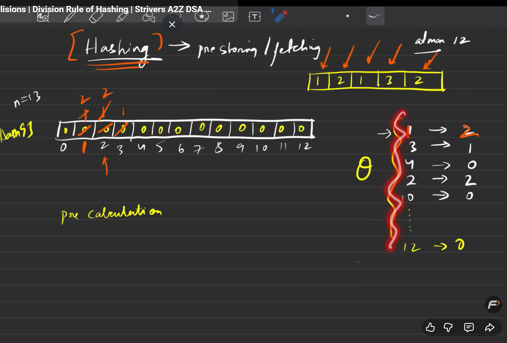
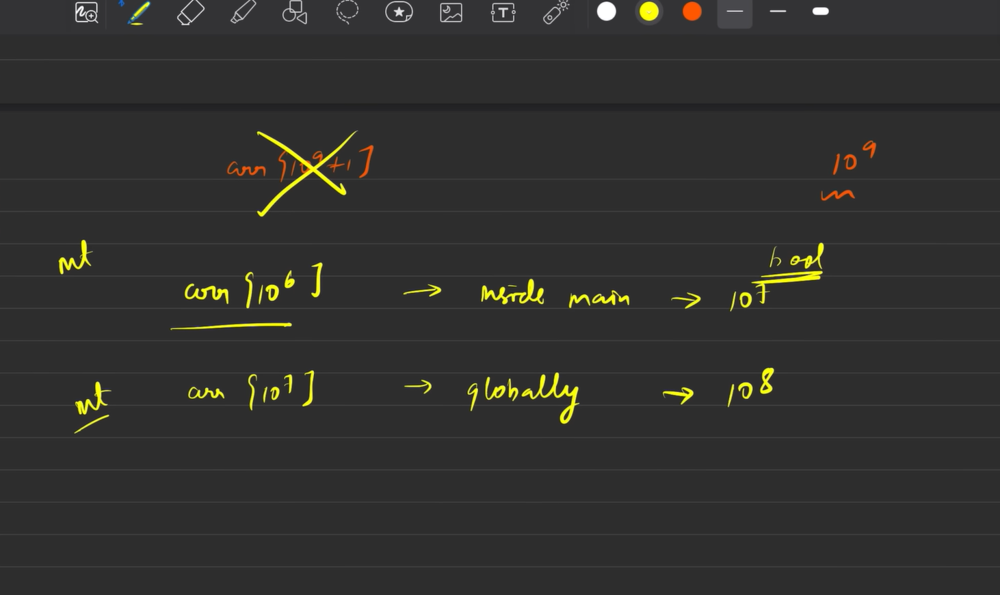
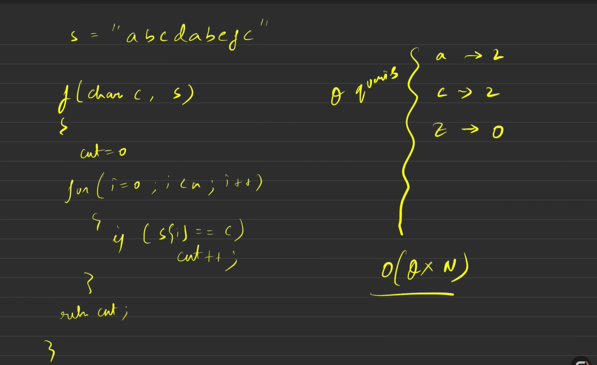

# Hashing

---
## What is Hashing?
Hashing is a technique used to uniquely identify a specific object from a group of similar objects. It involves converting input data of any size into a fixed-size string of text, usually a sequence of numbers and letters. This is done using a hash function.
---
## Why Use Hashing?
- **Fast Data Retrieval**: Hashing allows for quick data access, making it ideal for applications like databases and caches.
- **Data Integrity**: It helps in verifying data integrity by generating unique hash values for data
- **Efficient Storage**: Hashing can help in efficient data storage and retrieval in hash tables.
- **Cryptography**: Hash functions are widely used in cryptographic applications to ensure data security.
---
## How Hashing Works
1. **Input Data**: The data to be hashed (e.g., a string, file, or any other data type).
2. **Hash Function**: A mathematical function that processes the input data and produces a fixed-size hash value.
3. **Hash Value**: The output of the hash function, which is a unique representation of the input data.
---
## Common Hash Functions
- **MD5 (Message Digest Algorithm 5)**: Produces a 128-bit hash value, commonly used for checksums.
- **SHA-1 (Secure Hash Algorithm 1)**: Produces a 160-bit hash value, used in security applications.
- **SHA-256 (Secure Hash Algorithm 256)**: Produces a 256-bit hash value, widely used in blockchain technology.
The outer loop iterates through each element of the array multiple times until the entire array is sorted.

### Inner Loop
The inner loop compares adjacent elements and swaps them if they are in the wrong order, effectively "bubbling" the largest unsorted element to its correct position in each pass.
---

