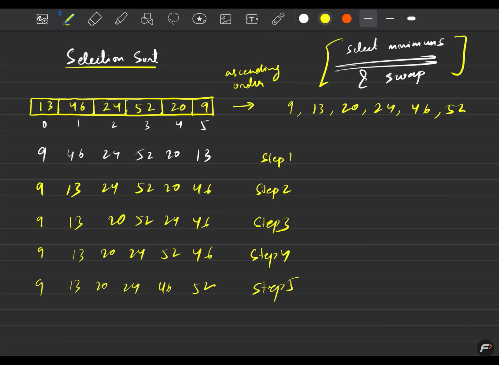
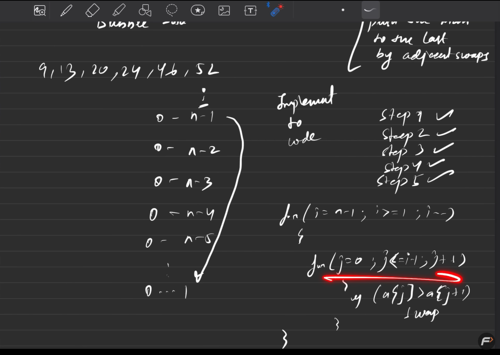

# Sorting
---
## Sorting Algorithms

### Selection Sort




#### 🧩 How Selection Sort Works (Step by Step)

#### Example Array
arr = [7, 3, 5, 2]

#### Pass 1 (i = 0)
- Assume the first element is the smallest → 7
- Compare it with the remaining elements
- Smallest element found → 2
- Swap 7 and 2

Result after Pass 1:
[2, 3, 5, 7]

#### Pass 2 (i = 1)
- Assume 3 is the smallest
- Compare with remaining elements
- No smaller element found
- No swap required

#### Pass 3 (i = 2)
- Only one element remains
- The array is already sorted

#### Final Sorted Array
[2, 3, 5, 7]

---

### 🔍 Understanding the Code

#### Outer Loop
```cpp
for(int i = 0; i < n-2; i++)
```
- Moves through the array position by position
- Decides where the smallest element should be placed

#### Assume Current Element is Minimum
```cpp
int mini = i
```
- Stores the index of the smallest element

#### Inner Loop (Finding the Smallest Element)
```cpp
for(int j = i; j <= n-1; j++){
    if(arr[j] < arr[mini]){
        mini = j;
    }
}
```
- Searches for the smallest element in the unsorted part of the array

#### Swap
```cpp
int temp = arr[mini]
arr[mini] = arr[i]
arr[i] = temp
```
- Places the smallest element at its correct position

---

### ⏱ Time Complexity
- Best Case: O(n²)
- Average Case: O(n²)
- Worst Case: O(n²)

Selection Sort always compares all elements, regardless of the input.

---

### 📌 Key Points
- Selection Sort is simple but slow
- It selects the minimum element in each pass
- Sorting is done in-place
- Suitable only for small datasets

---

### 🧠 One-Line Definition
Selection Sort repeatedly selects the smallest element from the unsorted part of the array and places it at the correct position.

---

## Bubble Sort


# Bubble Sort

## 🧩 How Bubble Sort Works (Step by Step)

### Example Array
arr = [7, 3, 5, 2]

### Pass 1
- Compare 7 and 3 → swap
- Compare 7 and 5 → swap
- Compare 7 and 2 → swap  
- Largest element moves to the end

Result after Pass 1:
[3, 5, 2, 7]

### Pass 2
- Compare 3 and 5 → no swap
- Compare 5 and 2 → swap  
- Second largest element moves to its correct position

Result after Pass 2:
[3, 2, 5, 7]

### Pass 3
- Compare 3 and 2 → swap
- Array becomes sorted

Result after Pass 3:
[2, 3, 5, 7]

### Final Sorted Array
[2, 3, 5, 7]

---

## 🔍 Understanding the Logic

### Outer Loop
for(int i = 0; i < n-1; i++)
- Controls the number of passes
- After each pass, the largest element is placed at the end

### Inner Loop
for(int j = 0; j < n-i-1; j++)
- Compares adjacent elements
- Swaps them if they are in the wrong order

### Swap
if(arr[j] > arr[j+1]){
    int temp = arr[j]
    arr[j] = arr[j+1]
    arr[j+1] = temp
}
- Pushes the larger element towards the end

---

## ⏱ Time Complexity
- Best Case: O(n) (already sorted array with optimization)
- Average Case: O(n²)
- Worst Case: O(n²)

---

## 📌 Key Points
- Bubble Sort compares adjacent elements
- Larger elements "bubble up" to the end
- Sorting is done in-place
- Very easy to understand but inefficient

---

## 🧠 One-Line Definition
Bubble Sort repeatedly compares adjacent elements and swaps them if they are in the wrong order until the array is sorted.
---


